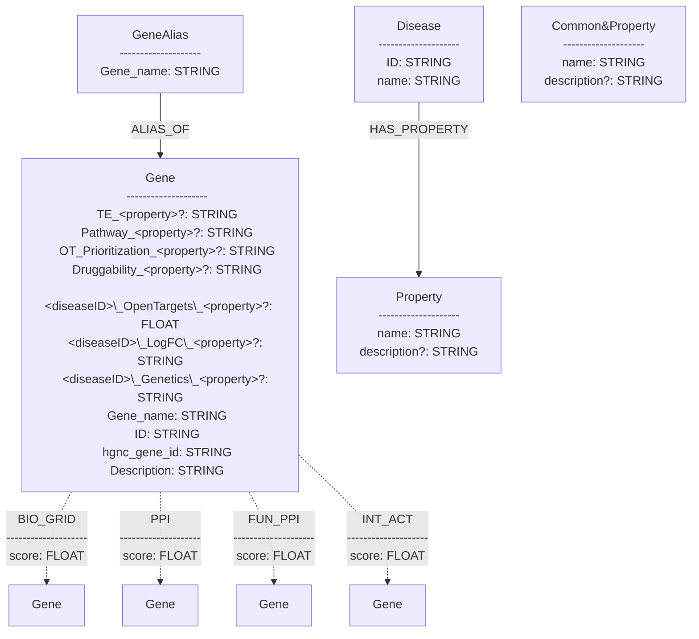

<!-- 
**NOTE:** This markdown file also contains a mermaid diagram. To visualize it, you can use a markdown viewer that supports mermaid diagrams, such as VSCode with the "Markdown Preview Mermaid Support" extension or online at https://markdownviewer.pages.dev/.
 -->

# Database Information

This document provides an overview of the database schema, including indexes, constraints, relationship types, and node types.

Neo4j Version: 5.20
Database Name: pdnet
Total Nodes: 108227
Total Relationships: 7079979

# Indexes and Constraints

The following indexes and constraints are defined in the database:

| name                 | type  | entityType | labelsOrTypes | properties |
| -------------------- | ----- | ---------- | ------------- | ---------- |
| Gene_name_Gene_Alias | RANGE | NODE       | GeneAlias     | Gene_name  |
| constraint_37ca0a5f  | RANGE | NODE       | Gene          | Gene_name  |
| constraint_75dc4c1a  | RANGE | NODE       | Gene          | ID         |
| constraint_cae0737e  | RANGE | NODE       | Disease       | ID         |

# Mermaid Schema Diagram

> **PS:** Node of type label `Common&Property` are disease independent properties on all Genes.

# Relationship Types

The following relationship types are defined in the database:

| name         | properties          | description                                                                                           | count   |
| ------------ | ------------------- | ----------------------------------------------------------------------------------------------------- | ------- |
| ALIAS_OF     |                     | Connects a GeneAlias node to its corresponding Gene node.                                             | 42970   |
| BIO_GRID     | score: FLOAT [-1,1] | Represents a biological interaction between two Gene nodes, with an associated score.                 | 221661  |
| PPI          | score: FLOAT [-1,1] | Represents a protein-protein interaction between two Gene nodes, with an associated score.            | 640467  |
| FUN_PPI      | score: FLOAT [-1,1] | Represents a functional protein-protein interaction between two Gene nodes, with an associated score. | 5695713 |
| INT_ACT      | score: FLOAT [-1,1] | Represents an interaction between two Gene nodes, with an associated score.                           | 479116  |
| HAS_PROPERTY |                     | Connects a Disease node to its associated Property nodes.                                             | 52      |

# Node Types

The following node types are defined in the database:

| name             | description                                             | count |
| ---------------- | ------------------------------------------------------- | ----- |
| Gene             | Represents a gene entity.                               | 41151 |
| GeneAlias        | Represents an alias for a gene.                         | 41408 |
| Disease          | Represents a disease entity.                            | 21898 |
| Property&!Common | Represents a property associated with a disease.        | 52    |
| Common&Property  | Represents common properties associated with all genes. | 3718  |

# Data Availability

Database dump is available at google drive. To access the file, please use the following link and request access:

https://drive.google.com/file/d/1PWnalvz2R1Sj-VtUJOrMYyagp850paxr/view?usp=drive_link