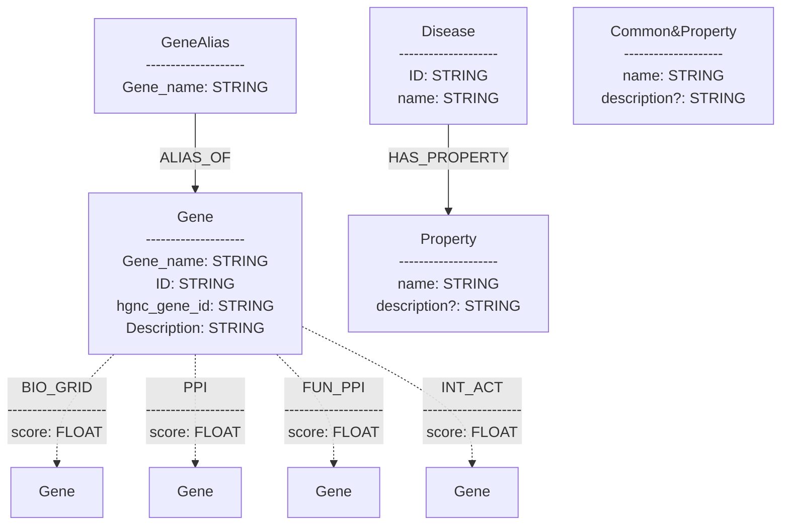

<!-- 
**NOTE:** This markdown file also contains a mermaid diagram. To visualize it, you can use a markdown viewer that supports mermaid diagrams, such as VSCode with the "Markdown Preview Mermaid Support" extension or online at https://markdownviewer.pages.dev/.
 -->

# Database Information

This document provides an overview of the database schema, including indexes, constraints, relationship types, and node types.

Neo4j Version: 5.20
Database Name: pdnet
Total Nodes: 108227
Total Relationships: 7079979

# Indexes and Constraints

The following indexes and constraints are defined in the database:

| name                 | type  | entityType | labelsOrTypes | properties |
| -------------------- | ----- | ---------- | ------------- | ---------- |
| Gene_name_Gene_Alias | RANGE | NODE       | GeneAlias     | Gene_name  |
| constraint_37ca0a5f  | RANGE | NODE       | Gene          | Gene_name  |
| constraint_75dc4c1a  | RANGE | NODE       | Gene          | ID         |
| constraint_cae0737e  | RANGE | NODE       | Disease       | ID         |

# Mermaid Schema Diagram

> **PS:** Node of type label `Common&Property` are disease independent properties on all Genes.

# Relationship Types

The following relationship types are defined in the database:

| name         | properties          | description                                                                                           | count   |
| ------------ | ------------------- | ----------------------------------------------------------------------------------------------------- | ------- |
| ALIAS_OF     |                     | Connects a GeneAlias node to its corresponding Gene node.                                             | 42970   |
| BIO_GRID     | score: FLOAT [-1,1] | Represents a biological interaction between two Gene nodes, with an associated score.                 | 221661  |
| PPI          | score: FLOAT [-1,1] | Represents a protein-protein interaction between two Gene nodes, with an associated score.            | 640467  |
| FUN_PPI      | score: FLOAT [-1,1] | Represents a functional protein-protein interaction between two Gene nodes, with an associated score. | 5695713 |
| INT_ACT      | score: FLOAT [-1,1] | Represents an interaction between two Gene nodes, with an associated score.                           | 479116  |
| HAS_PROPERTY |                     | Connects a Disease node to its associated Property nodes.                                             | 52      |

# Node Types

The following node types are defined in the database:

| name             | description                                             | count |
| ---------------- | ------------------------------------------------------- | ----- |
| Gene             | Represents a gene entity.                               | 41151 |
| GeneAlias        | Represents an alias for a gene.                         | 41408 |
| Disease          | Represents a disease entity.                            | 21898 |
| Property&!Common | Represents a property associated with a disease.        | 52    |
| Common&Property  | Represents common properties associated with all genes. | 3718  |

# ClickHouse Database Schema

## Overview

ClickHouse stores analytical data for gene properties, disease associations, and related metrics in a columnar format optimized for fast queries.

**Database Name:** default  
**Engine:** MergeTree family  
**Total Tables:** 9 (including 1 materialized view)

## Tables

### 1. pathway
Stores gene-pathway associations (binary: gene belongs to pathway or not).

| Column | Type | Description |
|--------|------|-------------|
| gene_id | LowCardinality(String) | Ensembl gene ID |
| property_name | LowCardinality(String) | Pathway name (e.g., "Wnt signaling") |
| score | Int8 | Binary indicator (0 or 1) |

**Primary Key:** `(gene_id, property_name)`  

### 2. druggability
Stores druggability scores for genes across different categories.

| Column | Type | Description |
|--------|------|-------------|
| gene_id | LowCardinality(String) | Ensembl gene ID |
| property_name | LowCardinality(String) | Druggability category |
| score | Float32 | Druggability score [0-1] |

**Primary Key:** `(gene_id, property_name)`  

### 3. tissue_specificity
Stores tissue expression specificity scores.

| Column | Type | Description |
|--------|------|-------------|
| gene_id | LowCardinality(String) | Ensembl gene ID |
| property_name | LowCardinality(String) | Tissue name |
| score | Float32 | Expression specificity score |

**Primary Key:** `(gene_id, property_name)`  

### 4. target_prioritization_factors
Stores OpenTargets target prioritization factor scores.

| Column | Type | Description |
|--------|------|-------------|
| gene_id | LowCardinality(String) | Ensembl gene ID |
| property_name | LowCardinality(String) | Prioritization factor name |
| score | Float32 | Factor score |

**Primary Key:** `(gene_id, property_name)`  

### 5. differential_expression
Stores disease-specific differential expression (LogFC) data.

| Column | Type | Description |
|--------|------|-------------|
| gene_id | LowCardinality(String) | Ensembl gene ID |
| disease_id | LowCardinality(String) | Disease ID (MONDO/EFO) |
| property_name | LowCardinality(String) | Study/tissue identifier |
| score | Float32 | Log fold change value |

**Primary Key:** `(disease_id, gene_id, property_name)`  

### 6. genetics
Stores disease-specific genetics evidence scores.

| Column | Type | Description |
|--------|------|-------------|
| gene_id | LowCardinality(String) | Ensembl gene ID |
| disease_id | LowCardinality(String) | Disease ID (MONDO/EFO) |
| property_name | LowCardinality(String) | Evidence type (e.g., "L2G", "coloc") |
| score | Float32 | Evidence score [0-1] |

**Primary Key:** `(disease_id, gene_id, property_name)`  

### 7. overall_association_score
Stores OpenTargets overall disease-gene association scores.

| Column | Type | Description |
|--------|------|-------------|
| gene_id | LowCardinality(String) | Ensembl gene ID |
| gene_name | LowCardinality(String) | Gene symbol (HGNC) |
| disease_id | LowCardinality(String) | Disease ID (MONDO/EFO) |
| score | Float32 | Overall association score [0-1] |

**Primary Key:** `(disease_id, gene_id)`  

### 8. datasource_association_score
Stores OpenTargets datasource-specific disease-gene association scores.

| Column | Type | Description |
|--------|------|-------------|
| gene_id | LowCardinality(String) | Ensembl gene ID |
| gene_name | LowCardinality(String) | Gene symbol (HGNC) |
| disease_id | LowCardinality(String) | Disease ID (MONDO/EFO) |
| datasource_id | LowCardinality(String) | Evidence datasource |
| score | Float32 | Datasource-specific score [0-1] |

**Primary Key:** `(disease_id, gene_id, datasource_id)`  

### 9. mv_datasource_association_score_overall_association_score (Materialized View)
Pre-joined view of datasource and overall association scores for query optimization.

| Column | Type | Description |
|--------|------|-------------|
| gene_id | LowCardinality(String) | Ensembl gene ID |
| gene_name | LowCardinality(String) | Gene symbol (HGNC) |
| disease_id | LowCardinality(String) | Disease ID (MONDO/EFO) |
| datasource_id | LowCardinality(String) | Evidence datasource |
| datasource_score | Float32 | Datasource-specific score |
| overall_score | Float32 | Overall association score |

**Engine:** MergeTree  
**Primary Key:** `(disease_id, gene_id)`  

## Table Categories

### Disease-Independent Tables
- `pathway`
- `druggability`
- `tissue_specificity`
- `target_prioritization_factors`

### Disease-Dependent Tables
- `differential_expression`
- `genetics`
- `overall_association_score`
- `datasource_association_score`

---

# PostgreSQL Database Schema

## Overview

PostgreSQL stores user session and authentication data.

**Database Name:** tdp  
**ORM:** Prisma  
**Tables:** 3

## Tables

### 1. Session
Stores user session information for JWT authentication.

| Column | Type | Constraints | Description |
|--------|------|-------------|-------------|
| id | UUID | PRIMARY KEY | Unique session ID (stored in JWT) |
| createdAt | TIMESTAMP | DEFAULT now() | Session creation time |

**Indexes:**
- Primary key on `id`

### 2. Combination
Stores validated group/program/project combinations for data commons access.

| Column | Type | Constraints | Description |
|--------|------|-------------|-------------|
| sessionId | UUID | FOREIGN KEY → Session(id) | Reference to session |
| group | VARCHAR | | Group identifier |
| program | VARCHAR | | Program identifier |
| project | VARCHAR | | Project identifier |
| verifiedAt | TIMESTAMP | DEFAULT now() | Verification timestamp |

**Composite Primary Key:** `(sessionId, group, program, project)`  
**Indexes:**
- Composite index on `(sessionId, group, program, project)`
- Foreign key index on `sessionId`

### 3. Feedback
Stores user feedback submissions.

| Column | Type | Constraints | Description |
|--------|------|-------------|-------------|
| id | UUID | PRIMARY KEY | Unique feedback ID |
| name | VARCHAR | NOT NULL | User name |
| email | VARCHAR | NOT NULL | User email |
| text | TEXT | NOT NULL | Feedback content |
| status | VARCHAR | DEFAULT 'pending' | Status: 'pending' or 'taken' |
| createdAt | TIMESTAMP | DEFAULT now() | Submission time |

**Indexes:**
- Primary key on `id`
- Index on `status`
- Index on `createdAt`

---

## Migration Guide

See [DATA_INGESTION.md](./DATA_INGESTION.md) for detailed instructions on data updates.